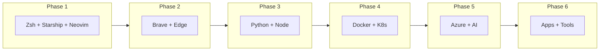

# Ubuntu 24.04 LTS - Cloud Architect Workstation Setup

Transform a fresh Ubuntu 24.04 LTS installation into a fully-equipped, AI-powered Cloud Architect workstation.

```
╔═══════════════════════════════════════════════════════════════════╗
║     Stability • Enterprise Integration • AI-Powered Dev           ║
╚═══════════════════════════════════════════════════════════════════╝
```

## 🎯 What This Does

A single, idempotent bash script that installs and configures everything a cloud architect needs - from browsers to Kubernetes tools to AI coding assistants.



## 📦 What Gets Installed

| Category | Tools |
|----------|-------|
| **Shell** | Zsh, Oh My Zsh, Starship prompt, autosuggestions, syntax-highlighting |
| **Editor** | Neovim with Lazy.nvim, Tokyo Night theme, Telescope, Treesitter |
| **Fonts** | FiraCode Nerd Font |
| **Browsers** | Brave (default), Microsoft Edge (O365/Teams) |
| **Runtimes** | Python 3 + pip + venv, nvm + Node.js LTS |
| **Containers** | Docker CE, Docker Compose, kubectl, Helm, k9s, kubectx/kubens |
| **Cloud & AI** | Azure CLI, Claude Code, Codex CLI |
| **Apps** | VS Code Insiders, 1Password, Spotify |
| **CLI Tools** | htop, btop, jq, yq, ripgrep, bat, eza, fzf, httpie, ncdu, and more |

## 🚀 Quick Start

```bash
# Clone and run
git clone https://github.com/YOUR_USERNAME/ubuntu-cloud-architect-setup.git
cd ubuntu-cloud-architect-setup
chmod +x cloud-architect-setup.sh
./cloud-architect-setup.sh
```

## 📖 Usage

### Run Everything
```bash
./cloud-architect-setup.sh
```

### Run Specific Phase
```bash
./cloud-architect-setup.sh --phase 1   # Foundation (Zsh, Starship, Neovim)
./cloud-architect-setup.sh --phase 2   # Browsers
./cloud-architect-setup.sh --phase 3   # Python + Node
./cloud-architect-setup.sh --phase 4   # Docker + Kubernetes
./cloud-architect-setup.sh --phase 5   # Azure CLI + AI tools
./cloud-architect-setup.sh --phase 6   # Apps + CLI tools
```

## 🔧 Phases Explained

### Phase 1: Foundation
- System update and upgrade
- Core build dependencies
- Zsh with Oh My Zsh
- Starship prompt with cloud architect config (Azure, K8s, Terraform context)
- FiraCode Nerd Font
- Neovim with Lazy.nvim plugin manager and essential plugins
- Plugins: git, autosuggestions, syntax-highlighting

### Phase 2: Browsers
- **Brave** - Privacy-focused, set as default
- **Microsoft Edge** - For O365 and Teams web apps

### Phase 3: Dev Runtimes
- Python 3 with pip and venv (configured for user installs)
- nvm (Node Version Manager)
- Node.js LTS with latest npm

### Phase 4: Containers & Kubernetes
- Docker CE with Compose plugin (no Docker Desktop)
- kubectl (latest stable)
- Helm 3
- k9s (terminal UI for Kubernetes)
- kubectx + kubens (fast context/namespace switching)

### Phase 5: Cloud & AI
- Azure CLI
- Claude Code (Anthropic's AI coding assistant)
- Codex CLI (OpenAI)

### Phase 6: Apps & Tools
- Visual Studio Code Insiders (latest features)
- 1Password (desktop app)
- Spotify
- CLI toolkit: htop, btop, jq, yq, ripgrep, bat, eza, fzf, httpie, ncdu, net-tools, dnsutils, tcpdump, nmap, and more

## ⌨️ Aliases Included

The script adds these handy aliases to your `.zshrc`:

```bash
code    # code-insiders
ll      # eza -la --git
cat     # batcat (syntax highlighted cat)
fd      # fdfind
k       # kubectl
kns     # kubens
kctx    # kubectx
dc      # docker compose
dps     # docker ps (formatted)
azs     # az account show (current subscription)
tf      # terraform
ports   # show listening ports
myip    # show public IP
```

## ✅ Post-Install Steps

After the script completes:

1. **Log out and back in** - Activates Zsh and Docker group membership

2. **Set your terminal font** to "FiraCode Nerd Font" for Starship icons to render properly

3. **Authenticate your tools:**
   ```bash
   az login                    # Azure CLI
   claude                      # Claude Code setup
   codex                       # Codex CLI setup
   ```

4. **Sign into apps:**
   - 1Password
   - Brave (sync if desired)
   - Spotify

5. **Verify installation:**
   ```bash
   docker --version
   kubectl version --client
   az --version
   node -v && npm -v
   python3 --version
   ```

## 🔄 Idempotent Design

The script is safe to re-run. Each installation step checks if the tool already exists before attempting installation. If something fails midway, just run it again.

## 🖥️ Requirements

- Ubuntu 24.04 LTS (fresh install recommended)
- Sudo access
- Internet connection
- ~4GB free disk space

## 🛠️ Customization

Fork this repo and modify the script to add your own tools. Each phase is a separate function, making it easy to add or remove components.

Common additions you might want:
- Terraform (`phase_5`)
- AWS CLI (`phase_5`)
- Podman (`phase_4`)
- Slack (`phase_6`)

## 📝 License

MIT - Do whatever you want with it.

## 🤝 Contributing

PRs welcome! Please keep the script:
- Idempotent (safe to re-run)
- Well-commented
- Using official package sources where possible

---

*Built for cloud architects who value stability, enterprise integration, and AI-powered development.*
